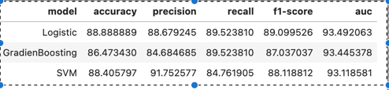

# Credit_Card_Approval_Classification
Application tool for predicting correct credit card customers ,the banks can maximize the profits.

Dataset :
*     raw_dataset = data/dataset.csv
*     preprocessed_dataset = data/training_data_processed.csv

For Pre-Processing Steps refer : notebooks/EDA.ipynb

For training out with difference model :
* Add key with your model name to  models dictionary in src/ModelDispactcher.py
* To run script the for different  models at one time please refer run.sh
* Command to Run : python -W ignore train.py --model {Model key}

#  Trained Model Performance
